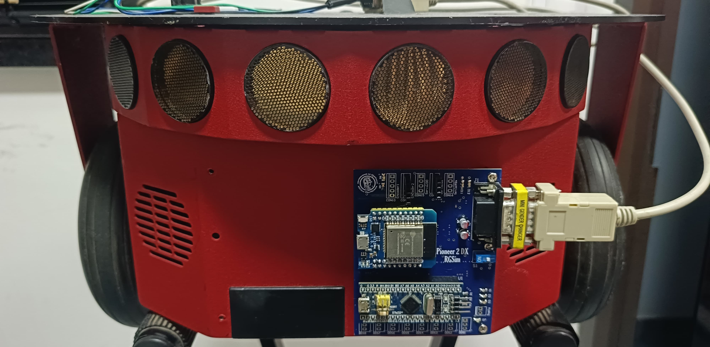
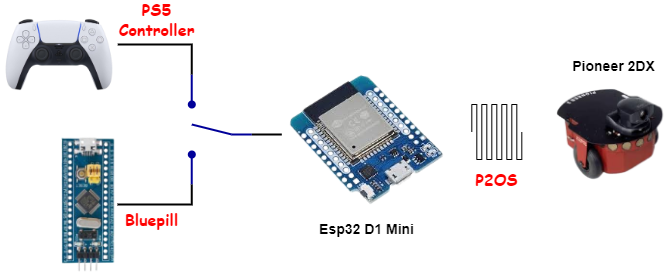

<h1 align="center">🤝 Pioneer 2 - Interface | Electronic MVP</h1>

 Electronic Module for the connection between pioneer 2 and Esp32

 <!--  -->

## 🌎 Real board in the robot

## 🧠 Overall board functionality

The Pioneer 2DX Interface has the mission to perform the computational logic behind the communication with the Pioneer 2DX and enable for an outside electronic device to send and receive data from the robot. Being more specific for this project, the Pioneer 2DX interface firmware has three main tasks:

- Connect the ESP32 D1 Mini with the bluepill
- Connect the ESP32 D1 Mini with a PS5 controller
- Connect the ESP32 D1 Mini with the pioneer 2DX

The Pioneer 2DX interface allows either a PS5 controller or the Bluepill device to send data to the ESP32, but never simultaneously, as shown in Figure 21. The complete code developed for this interface is available in the GitHub repository of our organization.

The PS5 Controller was added to the project to make it easier to validate the robot’s mechanical and electrical flow without needing to use the autonomous code. This approach allows for identifying issues without suspecting the bluepill code.

